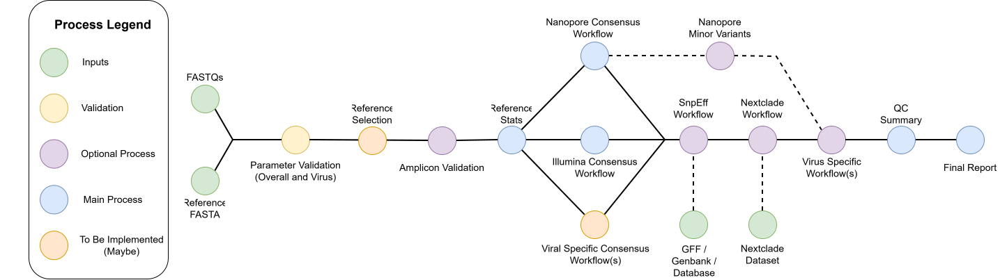

# VIRA

A generic viral assembly and QC pipeline for reference-based analysis of viral sequencing data. The pipeline supports both Oxford Nanopore and Illumina sequencing data and can be used with amplicon or non-amplicon sequencing approaches. This pipeline can be used as a starting point for analyses on viruses without dedicated workflows already available.

For Nanopore sequencing, the pipeline utilises a re-implementation of the [ARTIC pipeline](https://github.com/artic-network/fieldbioinformatics/tree/master/artic) for consensus sequence generation to separate out the individual steps allowing greater control on tool versions along with how data is run through the processes. As of [`v2.0.0`](https://github.com/phac-nml/measeq/releases/tag/2.0.0), Medaka and Nanopolish have been deprecated as variant callers and the pipeline now uses [`Clair3 v2`](https://github.com/HKU-BAL/clair3) for primary variant calling with Nanopore data

For Illumina sequencing, the pipeline integrates approaches, defaults, and standards from previous SARS-CoV-2, RSV, Mpox, and Measles work done at the lab with the current implementation of the pipeline useing [`FreeBayes`](https://github.com/freebayes/freebayes) as the default variant caller with the additional option to use iVar instead.

The goals of this pipeline are:

1. Provide a generic viral pipeline for the NML Surviellance Platform IRIDA-Next
2. Provide detailed and useful `Run` and `Sample` level final reports
3. Allow the pipeline to be used on viruses with a reference genome across a variety of sequencing approaches
4. Support downstream analyses by adopting virus specific processes based on requests and feedback with partner labs

Initial Simplified Workflow Diagram and potential next implementation steps


## Index

- [VIRA](#vira)
  - [Index](#index)
  - [Installation](#installation)
  - [Running Commands](#running-commands)
    - [Minimal Run Command](#minimal-run-command)
  - [Outputs](#outputs)
  - [Limitations](#limitations)
  - [Citations](#citations)
  - [Contributing](#contributing)
  - [Legal](#legal)

## Installation

1. Download and install nextflow

   1. Download and install with [conda](https://docs.conda.io/en/latest/miniconda.html)
      - Conda command: `conda create on nextflow -c conda-forge -c bioconda nextflow`
   2. Install with the instructions at https://www.nextflow.io/

2. Run the pipeline with one of the following profiles to handle dependencies (or use your own ``-profile` if you have one!):
   - `conda`
   - `mamba`
   - `singularity`
   - `docker`

## Running Commands

> [!TIP]
> More example commands are available in the [example commands document](./docs/example_commands.md).

Data can be ingested by the pipeline in two different ways:

1. Passing `--fastq_pass </PATH/TO/fastq_pass>` where `fastq_pass` is a directory containing `barcode##` subdirectories with fastq files or containing named `*.fastq*` files
   - Sample names are based off of the file names
   - Barcoded directories (`barcodexx`) can be renamed by passing in the [`--metadata` parameter](./docs/usage.md#metadata) with a TSV file mapping the barcode to the sample name
2. Passing `--input <samplesheet.csv>` where `samplesheet.csv` is a CSV file with three columns
   1. `sample` - The name of the sample
   2. `fastq_1` - Path to the first (or only) FastQ file (`.fastq`, `.fq`, `.fastq.gz`, `fq.gz`)
   3. `fastq_2` - Path to the second FastQ file for paired-end data (`.fastq`, `.fq`, `.fastq.gz`, `fq.gz`)

> [!NOTE] >
> All detailed running information is available in the [usage docs](./docs/usage.md).

### Minimal Run Command

Basic command:

```bash
nextflow run phac-nml/vira \
    -profile <PROFILE(s)> \
    --fastq_pass </PATH/TO/fastq_pass> \
    --platform <PLATFORM> \
    --reference <REF.fa> \
    --outdir <OUTDIR>
    <OPTIONAL INPUTS>
```

[Optional inputs](./docs/usage.md#all-parameters) could include:

- [Amplicon scheme](./docs/usage.md#schemes-and-reference) instead of just a reference fasta file
- [Metadata](./docs/usage.md#metadata)
- Filtering options
- GFF file for [SnpEff](./docs/usage.md#snpeff)
- [Nextclade](./docs/usage.md#nextclade) dataset specification
- Virus name for [virus specific options](./docs/usage.md#virus-specification)
- Skipping of specific processes
- Minor variant calling
- Output reporting options

> [!TIP]
> The pipeline could also be run with `--input CSV` to pass in an input CSV file with the sample names and fastq paths

## Outputs

Outputs are separated based off of their tool or file format and found in the `results/` directory by default.

Outputs include:

- Consensus fasta files
- VCF files
- Bam files
- Variant annotation files
- Nextclade results
- HTML summary files

> [!NOTE]
> More output information on pipeline steps and output files can be found in the [output docs](./docs/output.md).

## Limitations

As with any approach, there are limitations to the VIRA workflow which include:

1. Viruses require a reference genome to be run
   - No `de novo` assembly options available
2. Final reporting for segmented viruses is still being evaluated and will be improved in future versions
   - Relates to how to create the final QC table and reports
3. As a generic workflow defaults are set as sensibly as possible but may require adjustments based on the virus
   - For example, Mpox may require adjusting the Freebayes standard-filters argument to call variants in the ITRs

And then other specific analysis aspects to watch for your specific virus include:

1. SnpEff and database building/downloading which can be finicky
   - Database building/downloading requires one of three things:
     - The reference ID is in the SnpEff database
       - This allows the database to be downloaded
     - A gff3 file
       - This is used with the reference sequence to build a database
     - A well annotated NCBI genome matching the reference ID
       - This will pull the genbank file and use that to build a database
2. Nextclade automatic dataset selection can select different datasets per sample if multiple datasets exist
   - Can help better narrow down mutation abnormalities in specific samples
   - But it may be better to set the wanted dataset if one exists before running
3. For Nanopore data, the selection of the correct model can make difference in the mutations called so pick the model that best fits the sequencing and basecalling

> [!NOTE]
> Ensure the suitability of your reference genome, primer scheme, Clair3 model, and nextclade dataset with the sequencing data you hope to analyse.

## Citations

This pipeline uses code and infrastructure developed and maintained by the [nf-core](https://nf-co.re) community, reused here under the [MIT license](https://github.com/nf-core/tools/blob/master/LICENSE).

> The nf-core framework for community-curated bioinformatics pipelines.
>
> Philip Ewels, Alexander Peltzer, Sven Fillinger, Harshil Patel, Johannes Alneberg, Andreas Wilm, Maxime Ulysse Garcia, Paolo Di Tommaso & Sven Nahnsen.
>
> Nat Biotechnol. 2020 Feb 13. doi: 10.1038/s41587-020-0439-x.
> In addition, references of tools and data used in this pipeline are as follows:

Detailed citations for utilized tools are found in [the citations document](./citations.md)

## Contributing

Contributions are welcome through creating PRs or Issues

## Legal

Copyright 2026 Government of Canada

Licensed under the MIT License (the "License"); you may not use this work except in compliance with the License. You may obtain a copy of the License at:

https://opensource.org/license/mit/

Unless required by applicable law or agreed to in writing, software distributed under the License is distributed on an "AS IS" BASIS, WITHOUT WARRANTIES OR CONDITIONS OF ANY KIND, either express or implied. See the License for the specific language governing permissions and limitations under the License.
